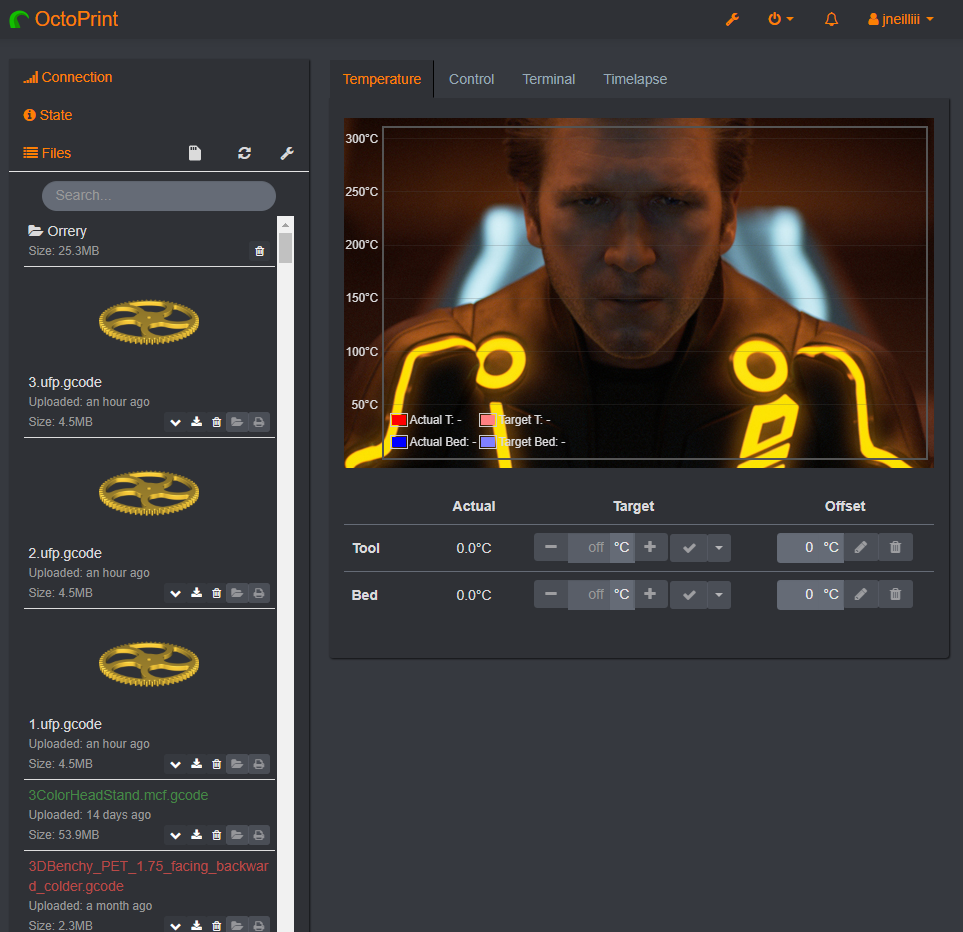

# Cura Thumbnails

(formerly Ultimaker Format Package)

This plugin adds support for Ultimaker Format Package (.ufp) files. Ultimaker Format Package files are based on Open Packaging Conventions (OPC) and contain compressed gcode and a preview thumbnail. This format will automatically be used by the [OctoPrint Connection](https://github.com/fieldOfView/Cura-OctoPrintPlugin) plugin in Cura (install via Marketplace) if this plugin is installed.

The preview thumbnail can be shown in OctoPrint from the files list by clicking the newly added image button.

The thumbnail will open in a modal window.

If enabled in settings the thumbnail can also be embedded as an inline thumbnail within the file list itself. If you use this option it's highly recommended to use Themify to make the file list taller and/or adjust the thumbnail's size.  The css selector for setting the file list height should be `#files > div > div.gcode_files > div.scroll-wrapper` and the css selector for the image should be `div.row-fluid.inline_thumbnail > img`.  For example to make a 100px wide centered image in the file list create the following css rules.

| Selector                                            | CSS-Rule     | Value |
|-----------------------------------------------------|--------------|-------|
| #files > div > div.gcode_files > div.scroll-wrapper | height       | 800px |
| div.row-fluid.inline_thumbnail > img                | width        | 100px |
| div.row-fluid.inline_thumbnail > img                | display      | block |
| div.row-fluid.inline_thumbnail > img                | margin-left  | auto  |
| div.row-fluid.inline_thumbnail > img                | margin-right | auto  |

## Setup

Install via the bundled [Plugin Manager](https://github.com/foosel/OctoPrint/wiki/Plugin:-Plugin-Manager)
or manually using this URL:

    https://github.com/jneilliii/OctoPrint-UltimakerFormatPackage/archive/master.zip

## Get Help

If you experience issues with this plugin or need assistance please use the issue tracker by clicking issues above.

### Additional Plugins

Check out my other plugins [here](https://plugins.octoprint.org/by_author/#jneilliii)

### Sponsors
- Andreas Lindermayr
- [@Mearman](https://github.com/Mearman)
- [@TheTuxKeeper](https://github.com/thetuxkeeper)
- [@tideline3d](https://github.com/tideline3d/)
- [OctoFarm](https://octofarm.net/)
- [SimplyPrint](https://simplyprint.dk/)
- [Andrew Beeman](https://github.com/Kiendeleo)
- [Calanish](https://github.com/calanish)
- [Lachlan Bell](https://lachy.io/)
- [Johnny Bergdal](https://github.com/bergdahl)
- [Leigh Johnson](https://github.com/leigh-johnson)
- [Stephen Berry](https://github.com/berrystephenw)
- [Guyot François](https://github.com/iFrostizz)
- César Romero
- [Steve Dougherty](https://github.com/Thynix)
- [Kyle Menigoz](https://menigoz.me)
## Support My Efforts
I, jneilliii, programmed this plugin for fun and do my best effort to support those that have issues with it, please return the favor and leave me a tip or become a Patron if you find this plugin helpful and want me to continue future development.

 

<small>No paypal.me? Send funds via PayPal to jneilliii&#64;gmail&#46;com</small>
